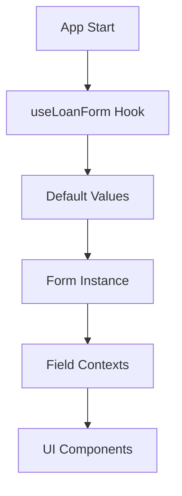
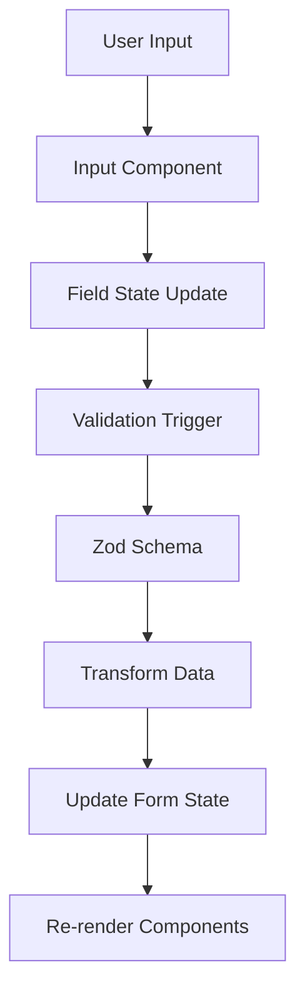
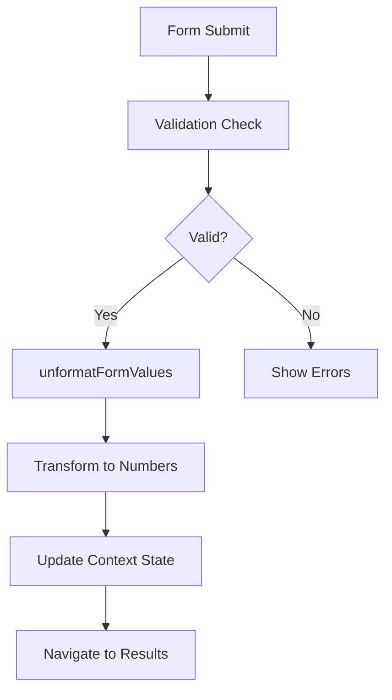

# Архитектура форм

## Обзор

Система форм в Mortgage Calculator TMA построена на основе современных React паттернов с использованием @tanstack/react-form, Zod для валидации и специализированных UI компонентов.

## 🏗️ Компоненты архитектуры

### 1. Управление состоянием форм

#### @tanstack/react-form
```typescript
// hooks/useLoanForm.ts
export const { useAppForm, withForm } = createFormHook({
  fieldContext,
  formContext,
  fieldComponents: {},
  formComponents: {},
});
```

**Ключевые особенности:**
- Декларативное управление состоянием
- Оптимизированные ререндеры
- Встроенная валидация
- Поддержка массивов и вложенных объектов

#### Контекст форм
```typescript
export const { fieldContext, formContext, useFieldContext, useFormContext } = createFormHookContexts();
```

**Назначение:**
- Изоляция состояния полей
- Переиспользование логики
- Типобезопасность

### 2. Схемы валидации

#### Базовые схемы
```typescript
// schemas/loanDetails.ts
export const loanDetailsSchema = z.object({
  loanAmount: z.string()
    .transform((val) => {
      const unformatted = unformat(val);
      return parseFloat(unformatted);
    })
    .refine((val) => !isNaN(val), 'Loan amount must be a number')
    .refine((val) => val > 0, 'Loan amount must be greater than 0'),
});
```

#### Локализованные схемы
```typescript
// schemas/localizedSchemas.ts
export const useLocalizedFormSchemas = () => {
  const schemas = useLocalizedSchemas();
  
  const loanDetailsSchema = z.object({
    loanAmount: schemas.createNumberSchema({
      fieldName: 'loanAmount',
      min: 0,
      max: 1000000000
    }),
  });
};
```

### 3. UI компоненты

#### Специализированные компоненты
```typescript
// components/ui/InputNumberFormat.tsx
const InputNumberFormat: FC<InputNumberFormatPropsType> = (props) => {
  return (
    <RIInputNumberFormat {...props} component={Input} />
  );
};
```

#### Интеграция с формами
```typescript
// components/form/LoanDetailsForm.tsx
<form.Field
  name={'loanAmount'}
  children={(field) => (
    <InputNumberFormat
      header={t('loanAmount')}
      placeholder={t('loanAmount')}
      field={field}
      inputMode='decimal'
      maximumFractionDigits={2}
    />
  )}
/>
```

## 🔄 Поток данных

### 1. Инициализация



### 2. Пользовательский ввод



### 3. Отправка формы



## 📁 Структура файлов

```
src/
├── hooks/
│   └── useLoanForm.ts              # Основной хук формы
├── schemas/
│   ├── loanDetails.ts              # Схема основных данных
│   ├── earlyPayment.ts             # Схема досрочных платежей
│   ├── regularPayment.ts           # Схема регулярных платежей
│   ├── formSchema.ts               # Общая схема формы
│   └── localizedSchemas.ts         # Локализованные схемы
├── components/
│   ├── form/
│   │   ├── LoanDetailsForm.tsx     # Форма основных данных
│   │   ├── EarlyPaymentsForm.tsx   # Форма досрочных платежей
│   │   └── RegularPaymentsForm.tsx # Форма регулярных платежей
│   └── ui/
│       ├── InputNumberFormat.tsx   # Компонент для чисел
│       ├── Input.tsx               # Базовый input
│       └── Select.tsx              # Компонент выбора
├── utils/
│   └── unformatFormValues.ts       # Утилиты трансформации
└── types/
    └── form.ts                     # Типы данных форм
```

## 🎯 Принципы проектирования

### 1. Разделение ответственности
- **Схемы**: Только валидация и трансформация
- **Хуки**: Управление состоянием и логика
- **Компоненты**: Отображение и пользовательское взаимодействие
- **Утилиты**: Чистые функции трансформации

### 2. Типобезопасность
```typescript
// Строгая типизация на всех уровнях
export type LoanDetailsType = {
  loanAmount: string;
  interestRate: string;
  // ...
};

export type ValidatedLoanDetails = z.infer<typeof loanDetailsSchema>;
```

### 3. Переиспользование
```typescript
// Переиспользуемые компоненты форм
const LoanDetailsForm = withForm({
  ...formOpts,
  render: function Render({ form }) {
    // Логика рендеринга
  },
});
```

### 4. Локализация
```typescript
// Локализованные сообщения об ошибках
const schemas = useLocalizedSchemas();
const loanAmount = schemas.createNumberSchema({
  fieldName: 'loanAmount',
  min: 0,
  max: 1000000000
});
```

## 🔧 Конфигурация

### Настройка формы
```typescript
export const formOpts = formOptions({
  defaultValues: defaultLoanDetails,
});
```

### Валидация
```typescript
return useAppForm({
  ...formOpts,
  validators: {
    onChange: formSchema,
  },
  onSubmit: async ({ value }) => {
    // Обработка отправки
  },
});
```

### Контекст полей
```typescript
export const { fieldContext, formContext, useFieldContext, useFormContext } = createFormHookContexts();
```

## 🚀 Расширение архитектуры

### Добавление нового поля
1. Обновить схему в `schemas/`
2. Добавить тип в `types/form.ts`
3. Создать компонент в `components/form/`
4. Интегрировать в основную форму

### Добавление новой валидации
1. Создать Zod схему
2. Добавить в локализованные схемы
3. Обновить типы
4. Протестировать интеграцию

## 📊 Производительность

### Оптимизации
- **Мемоизация**: Компоненты обернуты в `memo()`
- **Селекторы**: Использование селекторов для подписки на изменения
- **Ленивая валидация**: Валидация только при изменении полей
- **Контекстная изоляция**: Изоляция состояния полей

### Метрики
- Время инициализации формы: < 50ms
- Время валидации поля: < 10ms
- Время отправки формы: < 100ms
- Размер бандла форм: ~15KB

## 🔍 Отладка

### Инструменты разработчика
```typescript
// Логирование состояния формы
form.state.subscribe((state) => {
  console.log('Form state:', state);
});

// Логирование состояния поля
field.state.subscribe((state) => {
  console.log('Field state:', state);
});
```

### Общие проблемы
1. **Проблемы с валидацией**: Проверить Zod схему
2. **Проблемы с типами**: Проверить трансформации
3. **Проблемы с производительностью**: Проверить селекторы
4. **Проблемы с локализацией**: Проверить ключи переводов
