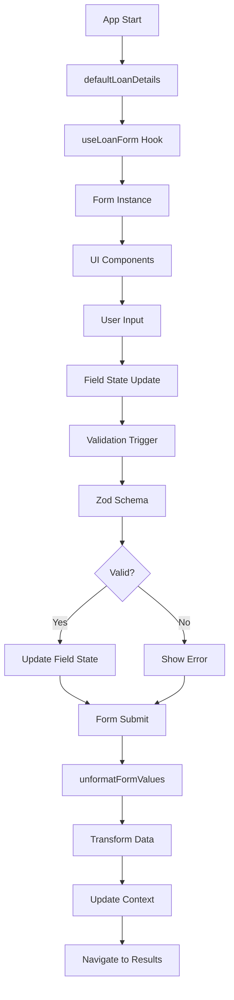

# Поток данных в формах

## Обзор

Документация описывает полный путь данных в системе форм от инициализации до финальной обработки, включая все трансформации и валидации.

## 🔄 Полный цикл данных

### 1. Инициализация

#### Значения по умолчанию
```typescript
// types/form.ts
export const defaultLoanDetails: LoanDetailsType = {
  loanAmount: '',                    // Пустая строка для форматирования
  interestRate: '',                  // Пустая строка для форматирования
  loanTerm: '',                     // Пустая строка для форматирования
  startDate: new Date().toISOString().split('T')[0], // Текущая дата
  paymentType: 'annuity',           // По умолчанию аннуитетные платежи
  paymentDay: new Date().getDate().toLocaleString(), // Текущий день месяца
  earlyPayments: [],                // Пустой массив досрочных платежей
  regularPayments: [],              // Пустой массив регулярных платежей
};
```

#### Создание экземпляра формы
```typescript
// hooks/useLoanForm.ts
export const useLoanForm = () => {
  const { setLoanDetails, setEarlyPayments, setRegularPayments } = useMortgage();
  const navigate = useNavigate();
  const { formSchema } = useLocalizedFormSchemas();
  
  return useAppForm({
    ...formOpts,                    // Значения по умолчанию
    validators: {
      onChange: formSchema,         // Схема валидации
    },
    onSubmit: async ({ value }) => {
      // Обработка отправки
    },
  });
};
```

### 2. Пользовательский ввод

#### Ввод данных в поле
```typescript
// Пользователь вводит "1000000" в поле loanAmount
const userInput = "1000000";
```

#### Обработка в компоненте
```typescript
// components/ui/InputNumberFormat.tsx
<InputNumberFormat
  header={t('loanAmount')}
  placeholder={t('loanAmount')}
  field={field}                     // Поле формы из @tanstack/react-form
  inputMode='decimal'
  maximumFractionDigits={2}
/>
```

#### Обновление состояния поля
```typescript
// @tanstack/react-form автоматически обновляет состояние
field.state.value = "1000000";
field.state.meta.isDirty = true;
field.state.meta.isTouched = true;
```

### 3. Валидация в реальном времени

#### Триггер валидации
```typescript
// При изменении поля срабатывает валидатор
validators: {
  onChange: formSchema,             // Zod схема валидации
}
```

#### Обработка в Zod схеме
```typescript
// schemas/loanDetails.ts
export const loanDetailsSchema = z.object({
  loanAmount: z.string()
    .transform((val) => {
      // 1. Убираем форматирование (пробелы, запятые)
      const unformatted = unformat(val);  // "1000000" → "1000000"
      // 2. Преобразуем в число
      return parseFloat(unformatted);     // "1000000" → 1000000
    })
    .refine((val) => !isNaN(val), 'Loan amount must be a number')
    .refine((val) => val > 0, 'Loan amount must be greater than 0')
    .refine((val) => val <= 1000000000, 'Loan amount is too large'),
});
```

#### Результат валидации
```typescript
// Успешная валидация
{
  success: true,
  data: 1000000,
  error: null
}

// Ошибка валидации
{
  success: false,
  data: null,
  error: {
    issues: [{
      code: "too_big",
      message: "Loan amount is too large",
      path: ["loanAmount"]
    }]
  }
}
```

### 4. Обновление UI

#### Отображение ошибок
```typescript
// components/form/LoanDetailsForm.tsx
<form.Field
  name={'loanAmount'}
  children={(field) => (
    <InputNumberFormat
      {...field.getInputProps()}
      status={field.state.meta.error ? 'error' : 'default'}
      bottom={field.state.meta.error}
    />
  )}
/>
```

#### Состояние кнопки отправки
```typescript
// components/form/LoanDetailsForm.tsx
<form.Subscribe
  selector={(state) => [state.canSubmit, state.isSubmitting]}
  children={([canSubmit, isSubmitting]) => (
    <Button
      type='submit'
      disabled={!canSubmit}
      loading={isSubmitting}
    >
      {t('calculate')}
    </Button>
  )}
/>
```

### 5. Отправка формы

#### Триггер отправки
```typescript
// Пользователь нажимает кнопку "Calculate"
<form onSubmit={(e) => {
  e.preventDefault();
  form.handleSubmit();
}}>
```

#### Обработка в хуке
```typescript
// hooks/useLoanForm.ts
onSubmit: async ({ value }) => {
  try {
    // 1. Трансформация данных
    const loanDetails = unformatFormValues(value);
    
    // 2. Разделение данных
    const { earlyPayments, regularPayments, ...rest } = loanDetails;
    
    // 3. Обновление контекста
    setLoanDetails(rest);
    setEarlyPayments(earlyPayments);
    setRegularPayments(regularPayments);
    
    // 4. Навигация
    navigate('result');
  } catch (error) {
    console.error('Form submission error:', error);
  }
}
```

### 6. Трансформация данных

#### Утилита unformatFormValues
```typescript
// utils/unformatFormValues.ts
export function unformatFormValues(values: LoanDetailsType) {
  return {
    loanAmount: parseFloat(unformat(values.loanAmount)),      // "1,000,000" → 1000000
    interestRate: parseFloat(unformat(values.interestRate)),  // "12.5%" → 12.5
    loanTerm: parseFloat(unformat(values.loanTerm)),          // "30 years" → 30
    startDate: values.startDate,                              // "2024-01-01" → "2024-01-01"
    paymentType: values.paymentType,                          // "annuity" → "annuity"
    paymentDay: parseInt(values.paymentDay),                  // "15" → 15
    earlyPayments: values.earlyPayments.map((earlyPayment) => ({
      ...earlyPayment,
      amount: parseFloat(unformat(earlyPayment.amount))       // "50,000" → 50000
    })),
    regularPayments: values.regularPayments.map((regularPayment) => ({
      ...regularPayment,
      amount: parseFloat(unformat(regularPayment.amount))     // "10,000" → 10000
    })),
  }
}
```

#### Результат трансформации
```typescript
// До трансформации (строки)
{
  loanAmount: "1,000,000",
  interestRate: "12.5%",
  loanTerm: "30 years",
  startDate: "2024-01-01",
  paymentType: "annuity",
  paymentDay: "15",
  earlyPayments: [
    {
      id: "1",
      amount: "50,000",
      date: "2024-06-01",
      type: "reduceTerm"
    }
  ]
}

// После трансформации (числа)
{
  loanAmount: 1000000,
  interestRate: 12.5,
  loanTerm: 30,
  startDate: "2024-01-01",
  paymentType: "annuity",
  paymentDay: 15,
  earlyPayments: [
    {
      id: "1",
      amount: 50000,
      date: "2024-06-01",
      type: "reduceTerm"
    }
  ]
}
```

### 7. Обновление глобального состояния

#### MortgageProvider
```typescript
// providers/MortgageProvider.tsx
const setLoanDetails = (details: ValidatedLoanDetails) => {
  setState(prev => ({
    ...prev,
    loanDetails: details
  }));
};

const setEarlyPayments = (payments: EarlyPayment[]) => {
  setState(prev => ({
    ...prev,
    earlyPayments: payments
  }));
};

const setRegularPayments = (payments: RegularPayment[]) => {
  setState(prev => ({
    ...prev,
    regularPayments: payments
  }));
};
```

### 8. Навигация к результатам

#### React Router
```typescript
// hooks/useLoanForm.ts
const navigate = useNavigate();

// После успешной обработки
navigate('result');
```

## 📊 Диаграмма потока данных



## 🔍 Детали трансформаций

### Форматирование чисел
```typescript
// Ввод пользователя
"1,000,000" → unformat() → "1000000" → parseFloat() → 1000000

// Проценты
"12.5%" → unformat() → "12.5" → parseFloat() → 12.5

// Единицы измерения
"30 years" → unformat() → "30" → parseFloat() → 30
```

### Валидация дат
```typescript
// Проверка формата даты
z.string().refine((date) => {
  const paymentDate = new Date(date);
  return !isNaN(paymentDate.getTime());
}, 'Invalid date format')
```

### Валидация массивов
```typescript
// Досрочные платежи
earlyPayments: z.array(earlyPaymentSchema.extend({ id: z.string() }))

// Регулярные платежи
regularPayments: z.array(regularPaymentSchema)
```

## ⚡ Оптимизации производительности

### Ленивая валидация
```typescript
// Валидация только при изменении
validators: {
  onChange: formSchema,  // Не при каждом рендере
}
```

### Селекторы состояния
```typescript
// Подписка только на нужные изменения
<form.Subscribe
  selector={(state) => [state.canSubmit, state.isSubmitting]}
  children={([canSubmit, isSubmitting]) => (
    // Рендер только при изменении canSubmit или isSubmitting
  )}
/>
```

### Мемоизация компонентов
```typescript
// Предотвращение лишних ререндеров
const LoanDetailsForm = memo(withForm({...}));
```

## 🐛 Отладка потока данных

### Логирование состояния
```typescript
// Отладка состояния формы
form.state.subscribe((state) => {
  console.log('Form state:', {
    values: state.values,
    isValid: state.isValid,
    canSubmit: state.canSubmit,
    errors: state.errors
  });
});

// Отладка состояния поля
field.state.subscribe((state) => {
  console.log('Field state:', {
    value: state.value,
    error: state.meta.error,
    isDirty: state.meta.isDirty,
    isTouched: state.meta.isTouched
  });
});
```

### Валидация в DevTools
```typescript
// Проверка схемы валидации
const result = formSchema.safeParse(formData);
if (!result.success) {
  console.error('Validation errors:', result.error.issues);
}
```

## 📝 Лучшие практики

### 1. Всегда используйте трансформации
```typescript
// ✅ Правильно
z.string().transform((val) => parseFloat(unformat(val)))

// ❌ Неправильно
z.string().refine((val) => !isNaN(parseFloat(val)))
```

### 2. Валидируйте после трансформации
```typescript
// ✅ Правильно
z.string()
  .transform((val) => parseFloat(unformat(val)))
  .refine((val) => val > 0, 'Must be positive')

// ❌ Неправильно
z.string()
  .refine((val) => parseFloat(val) > 0, 'Must be positive')
  .transform((val) => parseFloat(val))
```

### 3. Используйте типизированные селекторы
```typescript
// ✅ Правильно
selector={(state) => [state.canSubmit, state.isSubmitting]}

// ❌ Неправильно
selector={(state) => state}  // Подписка на все изменения
```

### 4. Обрабатывайте ошибки
```typescript
// ✅ Правильно
try {
  const loanDetails = unformatFormValues(value);
  // Обработка
} catch (error) {
  console.error('Form submission error:', error);
  // Показать пользователю
}
```
