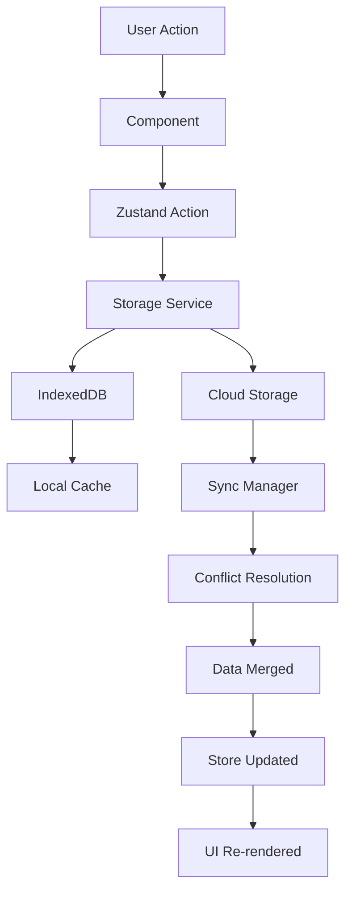

# Архитектура хранилища данных

## Обзор

Детальная архитектура глобального хранилища данных для приложения Mortgage Calculator TMA с использованием Zustand, IndexedDB и Telegram Cloud Storage.

## 🏗️ Общая архитектура

### 1. Слои архитектуры

```
┌─────────────────────────────────────────────────────────┐
│                    UI Layer                             │
│  ┌─────────────┐ ┌─────────────┐ ┌─────────────┐      │
│  │ Components  │ │   Hooks     │ │   Pages     │      │
│  └─────────────┘ └─────────────┘ └─────────────┘      │
└─────────────────────────────────────────────────────────┘
                            │
┌─────────────────────────────────────────────────────────┐
│                 State Layer                             │
│  ┌─────────────┐ ┌─────────────┐ ┌─────────────┐      │
│  │ Zustand     │ │   Actions   │ │  Selectors  │      │
│  │ Store       │ │             │ │             │      │
│  └─────────────┘ └─────────────┘ └─────────────┘      │
└─────────────────────────────────────────────────────────┘
                            │
┌─────────────────────────────────────────────────────────┐
│                Service Layer                            │
│  ┌─────────────┐ ┌─────────────┐ ┌─────────────┐      │
│  │ Storage     │ │    Sync     │ │   Cache     │      │
│  │ Service     │ │  Manager    │ │  Manager    │      │
│  └─────────────┘ └─────────────┘ └─────────────┘      │
└─────────────────────────────────────────────────────────┘
                            │
┌─────────────────────────────────────────────────────────┐
│                Storage Layer                            │
│  ┌─────────────┐ ┌─────────────┐ ┌─────────────┐      │
│  │ IndexedDB   │ │ Telegram    │ │   Memory    │      │
│  │ Storage     │ │ Cloud       │ │   Cache     │      │
│  └─────────────┘ └─────────────┘ └─────────────┘      │
└─────────────────────────────────────────────────────────┘
```

### 2. Поток данных



## 📦 Структура данных

### 1. Основные типы

```typescript
// Расчет
export interface SavedCalculation {
  id: string;
  title: string;
  description?: string;
  createdAt: Date;
  updatedAt: Date;
  isShared: boolean;
  shareId?: string;
  
  // Данные расчета
  loanDetails: LoanDetailsValues;
  earlyPayments: EarlyPayment[];
  regularPayments: RegularPayment[];
  
  // Результаты
  mortgageResults: MortgageCalculationResults;
  amortizationResult: AmortizationScheduleResults;
  
  // Метаданные
  tags: string[];
  isFavorite: boolean;
  viewCount: number;
  
  // Синхронизация
  lastSyncedAt?: Date;
  syncStatus: 'pending' | 'synced' | 'error';
  version: number;
}

// Пользователь
export interface UserProfile {
  id: string;
  calculations: SavedCalculation[];
  preferences: UserPreferences;
  statistics: UserStatistics;
  createdAt: Date;
  updatedAt: Date;
}

// Настройки
export interface AppSettings {
  language: SupportedLanguage;
  theme: ThemeMode;
  autoSave: boolean;
  shareByDefault: boolean;
  notifications: NotificationSettings;
  syncEnabled: boolean;
  lastSyncAt?: Date;
}

// Статус синхронизации
export interface SyncStatus {
  status: 'idle' | 'syncing' | 'success' | 'error';
  lastSyncAt?: Date;
  pendingChanges: number;
  error?: string;
}

// UI состояние
export interface UIState {
  isLoading: boolean;
  currentPage: string;
  modals: ModalState[];
  notifications: Notification[];
}
```

### 2. Схема IndexedDB

```typescript
// База данных
const DB_NAME = 'MortgageCalculatorDB';
const DB_VERSION = 1;

// Stores
const STORES = {
  CALCULATIONS: 'calculations',
  USER_PROFILE: 'userProfile',
  SETTINGS: 'settings',
  CACHE: 'cache',
  SYNC_QUEUE: 'syncQueue'
} as const;

// Индексы
const INDEXES = {
  calculations: {
    byTitle: 'title',
    byCreatedAt: 'createdAt',
    byUpdatedAt: 'updatedAt',
    byTags: 'tags',
    byIsFavorite: 'isFavorite',
    bySyncStatus: 'syncStatus'
  },
  syncQueue: {
    byPriority: 'priority',
    byCreatedAt: 'createdAt'
  }
} as const;
```

## 🔧 Реализация

### 1. Zustand Store

```typescript
// stores/appStore.ts
import { create } from 'zustand';
import { persist, subscribeWithSelector } from 'zustand/middleware';
import { immer } from 'zustand/middleware/immer';
import { StorageService } from '@/services/storage/StorageService';

interface AppStore {
  // Состояние
  calculations: SavedCalculation[];
  settings: AppSettings;
  syncStatus: SyncStatus;
  ui: UIState;
  
  // Действия с расчетами
  addCalculation: (calculation: Omit<SavedCalculation, 'id' | 'createdAt' | 'updatedAt'>) => Promise<void>;
  updateCalculation: (id: string, updates: Partial<SavedCalculation>) => Promise<void>;
  deleteCalculation: (id: string) => Promise<void>;
  getCalculation: (id: string) => SavedCalculation | undefined;
  searchCalculations: (query: string) => SavedCalculation[];
  
  // Настройки
  updateSettings: (settings: Partial<AppSettings>) => Promise<void>;
  
  // Синхронизация
  sync: () => Promise<void>;
  forceSync: () => Promise<void>;
  
  // UI
  setUI: (ui: Partial<UIState>) => void;
  showModal: (modal: ModalState) => void;
  hideModal: (id: string) => void;
  
  // Инициализация
  initialize: () => Promise<void>;
}

export const useAppStore = create<AppStore>()(
  subscribeWithSelector(
    persist(
      immer((set, get) => ({
        // Начальное состояние
        calculations: [],
        settings: {
          language: 'en',
          theme: 'light',
          autoSave: true,
          shareByDefault: false,
          notifications: {
            syncComplete: true,
            errors: true
          },
          syncEnabled: true
        },
        syncStatus: {
          status: 'idle',
          pendingChanges: 0
        },
        ui: {
          isLoading: false,
          currentPage: '/',
          modals: [],
          notifications: []
        },
        
        // Действия с расчетами
        addCalculation: async (calculationData) => {
          const calculation: SavedCalculation = {
            ...calculationData,
            id: generateId(),
            createdAt: new Date(),
            updatedAt: new Date(),
            syncStatus: 'pending',
            version: 1
          };
          
          set((state) => {
            state.calculations.push(calculation);
            state.syncStatus.pendingChanges += 1;
          });
          
          try {
            await StorageService.saveCalculation(calculation);
            await get().sync();
          } catch (error) {
            console.error('Failed to save calculation:', error);
            set((state) => {
              state.syncStatus.status = 'error';
              state.syncStatus.error = error.message;
            });
          }
        },
        
        updateCalculation: async (id, updates) => {
          set((state) => {
            const calculation = state.calculations.find(calc => calc.id === id);
            if (calculation) {
              Object.assign(calculation, updates, {
                updatedAt: new Date(),
                syncStatus: 'pending',
                version: calculation.version + 1
              });
              state.syncStatus.pendingChanges += 1;
            }
          });
          
          try {
            await StorageService.updateCalculation(id, updates);
            await get().sync();
          } catch (error) {
            console.error('Failed to update calculation:', error);
            set((state) => {
              state.syncStatus.status = 'error';
              state.syncStatus.error = error.message;
            });
          }
        },
        
        deleteCalculation: async (id) => {
          set((state) => {
            state.calculations = state.calculations.filter(calc => calc.id !== id);
            state.syncStatus.pendingChanges += 1;
          });
          
          try {
            await StorageService.deleteCalculation(id);
            await get().sync();
          } catch (error) {
            console.error('Failed to delete calculation:', error);
            set((state) => {
              state.syncStatus.status = 'error';
              state.syncStatus.error = error.message;
            });
          }
        },
        
        getCalculation: (id) => {
          return get().calculations.find(calc => calc.id === id);
        },
        
        searchCalculations: (query) => {
          const calculations = get().calculations;
          const lowerQuery = query.toLowerCase();
          
          return calculations.filter(calc =>
            calc.title.toLowerCase().includes(lowerQuery) ||
            calc.description?.toLowerCase().includes(lowerQuery) ||
            calc.tags.some(tag => tag.toLowerCase().includes(lowerQuery))
          );
        },
        
        // Настройки
        updateSettings: async (settings) => {
          set((state) => {
            Object.assign(state.settings, settings);
          });
          
          try {
            await StorageService.updateSettings(settings);
            await get().sync();
          } catch (error) {
            console.error('Failed to update settings:', error);
          }
        },
        
        // Синхронизация
        sync: async () => {
          const { syncStatus } = get();
          if (syncStatus.status === 'syncing') return;
          
          set((state) => {
            state.syncStatus.status = 'syncing';
          });
          
          try {
            await StorageService.sync();
            set((state) => {
              state.syncStatus.status = 'success';
              state.syncStatus.lastSyncAt = new Date();
              state.syncStatus.pendingChanges = 0;
              state.syncStatus.error = undefined;
            });
          } catch (error) {
            console.error('Sync failed:', error);
            set((state) => {
              state.syncStatus.status = 'error';
              state.syncStatus.error = error.message;
            });
          }
        },
        
        forceSync: async () => {
          set((state) => {
            state.syncStatus.status = 'syncing';
          });
          
          try {
            await StorageService.forceSync();
            set((state) => {
              state.syncStatus.status = 'success';
              state.syncStatus.lastSyncAt = new Date();
              state.syncStatus.pendingChanges = 0;
              state.syncStatus.error = undefined;
            });
          } catch (error) {
            console.error('Force sync failed:', error);
            set((state) => {
              state.syncStatus.status = 'error';
              state.syncStatus.error = error.message;
            });
          }
        },
        
        // UI
        setUI: (ui) => {
          set((state) => {
            Object.assign(state.ui, ui);
          });
        },
        
        showModal: (modal) => {
          set((state) => {
            state.ui.modals.push(modal);
          });
        },
        
        hideModal: (id) => {
          set((state) => {
            state.ui.modals = state.ui.modals.filter(modal => modal.id !== id);
          });
        },
        
        // Инициализация
        initialize: async () => {
          set((state) => {
            state.ui.isLoading = true;
          });
          
          try {
            const data = await StorageService.loadAllData();
            set((state) => {
              state.calculations = data.calculations;
              state.settings = data.settings;
            });
            
            // Автоматическая синхронизация
            if (data.settings.syncEnabled) {
              await get().sync();
            }
          } catch (error) {
            console.error('Failed to initialize store:', error);
          } finally {
            set((state) => {
              state.ui.isLoading = false;
            });
          }
        }
      })),
      {
        name: 'mortgage-calculator-storage',
        partialize: (state) => ({
          calculations: state.calculations,
          settings: state.settings
        })
      }
    )
  )
);
```

### 2. Storage Service

```typescript
// services/storage/StorageService.ts
import { IndexedDBStorage } from './IndexedDBStorage';
import { TelegramCloudStorage } from './TelegramCloudStorage';
import { SyncManager } from './SyncManager';
import { CacheManager } from './CacheManager';

export class StorageService {
  private localStorage: IndexedDBStorage;
  private cloudStorage: TelegramCloudStorage;
  private syncManager: SyncManager;
  private cacheManager: CacheManager;
  
  constructor() {
    this.localStorage = new IndexedDBStorage();
    this.cloudStorage = new TelegramCloudStorage();
    this.syncManager = new SyncManager(this.localStorage, this.cloudStorage);
    this.cacheManager = new CacheManager();
  }
  
  // Инициализация
  async initialize(): Promise<void> {
    await this.localStorage.initialize();
    await this.cloudStorage.initialize();
    await this.syncManager.initialize();
    await this.cacheManager.initialize();
  }
  
  // Расчеты
  async saveCalculation(calculation: SavedCalculation): Promise<void> {
    // Сохранить локально
    await this.localStorage.saveCalculation(calculation);
    
    // Добавить в кэш
    this.cacheManager.setCalculation(calculation);
    
    // Добавить в очередь синхронизации
    await this.syncManager.addToSyncQueue(calculation);
  }
  
  async getCalculation(id: string): Promise<SavedCalculation | null> {
    // Проверить кэш
    const cached = this.cacheManager.getCalculation(id);
    if (cached) return cached;
    
    // Загрузить из локального хранилища
    const calculation = await this.localStorage.getCalculation(id);
    if (calculation) {
      this.cacheManager.setCalculation(calculation);
    }
    
    return calculation;
  }
  
  async getAllCalculations(): Promise<SavedCalculation[]> {
    // Проверить кэш
    const cached = this.cacheManager.getAllCalculations();
    if (cached.length > 0) return cached;
    
    // Загрузить из локального хранилища
    const calculations = await this.localStorage.getAllCalculations();
    
    // Обновить кэш
    this.cacheManager.setCalculations(calculations);
    
    return calculations;
  }
  
  async updateCalculation(id: string, updates: Partial<SavedCalculation>): Promise<void> {
    // Обновить локально
    await this.localStorage.updateCalculation(id, updates);
    
    // Обновить кэш
    this.cacheManager.updateCalculation(id, updates);
    
    // Добавить в очередь синхронизации
    await this.syncManager.addToSyncQueue({ id, ...updates });
  }
  
  async deleteCalculation(id: string): Promise<void> {
    // Удалить локально
    await this.localStorage.deleteCalculation(id);
    
    // Удалить из кэша
    this.cacheManager.deleteCalculation(id);
    
    // Добавить в очередь синхронизации
    await this.syncManager.addToSyncQueue({ id, _deleted: true });
  }
  
  // Настройки
  async updateSettings(settings: Partial<AppSettings>): Promise<void> {
    await this.localStorage.updateSettings(settings);
    await this.syncManager.addToSyncQueue({ type: 'settings', ...settings });
  }
  
  // Загрузка всех данных
  async loadAllData(): Promise<{
    calculations: SavedCalculation[];
    settings: AppSettings;
  }> {
    const [calculations, settings] = await Promise.all([
      this.getAllCalculations(),
      this.localStorage.getSettings()
    ]);
    
    return { calculations, settings };
  }
  
  // Синхронизация
  async sync(): Promise<void> {
    await this.syncManager.sync();
  }
  
  async forceSync(): Promise<void> {
    await this.syncManager.forceSync();
  }
  
  // Очистка
  async clear(): Promise<void> {
    await this.localStorage.clear();
    await this.cloudStorage.clear();
    this.cacheManager.clear();
  }
}
```

### 3. IndexedDB Storage

```typescript
// services/storage/IndexedDBStorage.ts
export class IndexedDBStorage {
  private db: IDBDatabase | null = null;
  
  async initialize(): Promise<void> {
    return new Promise((resolve, reject) => {
      const request = indexedDB.open(DB_NAME, DB_VERSION);
      
      request.onerror = () => reject(request.error);
      request.onsuccess = () => {
        this.db = request.result;
        resolve();
      };
      
      request.onupgradeneeded = (event) => {
        const db = (event.target as IDBOpenDBRequest).result;
        this.createStores(db);
      };
    });
  }
  
  private createStores(db: IDBDatabase): void {
    // Calculations store
    if (!db.objectStoreNames.contains(STORES.CALCULATIONS)) {
      const store = db.createObjectStore(STORES.CALCULATIONS, { keyPath: 'id' });
      store.createIndex('byTitle', 'title', { unique: false });
      store.createIndex('byCreatedAt', 'createdAt', { unique: false });
      store.createIndex('byUpdatedAt', 'updatedAt', { unique: false });
      store.createIndex('byTags', 'tags', { unique: false, multiEntry: true });
      store.createIndex('byIsFavorite', 'isFavorite', { unique: false });
      store.createIndex('bySyncStatus', 'syncStatus', { unique: false });
    }
    
    // Settings store
    if (!db.objectStoreNames.contains(STORES.SETTINGS)) {
      db.createObjectStore(STORES.SETTINGS, { keyPath: 'key' });
    }
    
    // Sync queue store
    if (!db.objectStoreNames.contains(STORES.SYNC_QUEUE)) {
      const store = db.createObjectStore(STORES.SYNC_QUEUE, { keyPath: 'id' });
      store.createIndex('byPriority', 'priority', { unique: false });
      store.createIndex('byCreatedAt', 'createdAt', { unique: false });
    }
  }
  
  async saveCalculation(calculation: SavedCalculation): Promise<void> {
    return this.withTransaction(STORES.CALCULATIONS, 'readwrite', (store) => {
      return new Promise((resolve, reject) => {
        const request = store.put(calculation);
        request.onsuccess = () => resolve();
        request.onerror = () => reject(request.error);
      });
    });
  }
  
  async getCalculation(id: string): Promise<SavedCalculation | null> {
    return this.withTransaction(STORES.CALCULATIONS, 'readonly', (store) => {
      return new Promise((resolve, reject) => {
        const request = store.get(id);
        request.onsuccess = () => resolve(request.result || null);
        request.onerror = () => reject(request.error);
      });
    });
  }
  
  async getAllCalculations(): Promise<SavedCalculation[]> {
    return this.withTransaction(STORES.CALCULATIONS, 'readonly', (store) => {
      return new Promise((resolve, reject) => {
        const request = store.getAll();
        request.onsuccess = () => resolve(request.result || []);
        request.onerror = () => reject(request.error);
      });
    });
  }
  
  async updateCalculation(id: string, updates: Partial<SavedCalculation>): Promise<void> {
    const calculation = await this.getCalculation(id);
    if (!calculation) throw new Error('Calculation not found');
    
    const updatedCalculation = { ...calculation, ...updates };
    await this.saveCalculation(updatedCalculation);
  }
  
  async deleteCalculation(id: string): Promise<void> {
    return this.withTransaction(STORES.CALCULATIONS, 'readwrite', (store) => {
      return new Promise((resolve, reject) => {
        const request = store.delete(id);
        request.onsuccess = () => resolve();
        request.onerror = () => reject(request.error);
      });
    });
  }
  
  async getSettings(): Promise<AppSettings> {
    return this.withTransaction(STORES.SETTINGS, 'readonly', (store) => {
      return new Promise((resolve, reject) => {
        const request = store.get('settings');
        request.onsuccess = () => resolve(request.result || defaultSettings);
        request.onerror = () => reject(request.error);
      });
    });
  }
  
  async updateSettings(settings: Partial<AppSettings>): Promise<void> {
    const currentSettings = await this.getSettings();
    const updatedSettings = { ...currentSettings, ...settings };
    
    return this.withTransaction(STORES.SETTINGS, 'readwrite', (store) => {
      return new Promise((resolve, reject) => {
        const request = store.put(updatedSettings, 'settings');
        request.onsuccess = () => resolve();
        request.onerror = () => reject(request.error);
      });
    });
  }
  
  async clear(): Promise<void> {
    await this.withTransaction(STORES.CALCULATIONS, 'readwrite', (store) => {
      return new Promise((resolve, reject) => {
        const request = store.clear();
        request.onsuccess = () => resolve();
        request.onerror = () => reject(request.error);
      });
    });
  }
  
  private async withTransaction<T>(
    storeName: string,
    mode: IDBTransactionMode,
    operation: (store: IDBObjectStore) => Promise<T>
  ): Promise<T> {
    if (!this.db) throw new Error('Database not initialized');
    
    const transaction = this.db.transaction([storeName], mode);
    const store = transaction.objectStore(storeName);
    
    return operation(store);
  }
}
```

### 4. Telegram Cloud Storage

```typescript
// services/storage/TelegramCloudStorage.ts
import { CloudStorage } from '@telegram-apps/sdk-react';

export class TelegramCloudStorage {
  private cloudStorage: CloudStorage;
  
  constructor() {
    this.cloudStorage = new CloudStorage();
  }
  
  async initialize(): Promise<void> {
    // Cloud Storage инициализируется автоматически
  }
  
  async saveCalculation(calculation: SavedCalculation): Promise<void> {
    const key = `calculation_${calculation.id}`;
    const data = JSON.stringify(calculation);
    await this.cloudStorage.setItem(key, data);
  }
  
  async getCalculation(id: string): Promise<SavedCalculation | null> {
    const key = `calculation_${id}`;
    const data = await this.cloudStorage.getItem(key);
    return data ? JSON.parse(data) : null;
  }
  
  async getAllCalculations(): Promise<SavedCalculation[]> {
    const keys = await this.cloudStorage.getKeys();
    const calculationKeys = keys.filter(key => key.startsWith('calculation_'));
    
    const calculations = await Promise.all(
      calculationKeys.map(key => this.getCalculation(key.replace('calculation_', '')))
    );
    
    return calculations.filter(Boolean) as SavedCalculation[];
  }
  
  async updateCalculation(id: string, updates: Partial<SavedCalculation>): Promise<void> {
    const calculation = await this.getCalculation(id);
    if (!calculation) throw new Error('Calculation not found');
    
    const updatedCalculation = { ...calculation, ...updates };
    await this.saveCalculation(updatedCalculation);
  }
  
  async deleteCalculation(id: string): Promise<void> {
    const key = `calculation_${id}`;
    await this.cloudStorage.removeItem(key);
  }
  
  async clear(): Promise<void> {
    const keys = await this.cloudStorage.getKeys();
    await Promise.all(keys.map(key => this.cloudStorage.removeItem(key)));
  }
}
```

### 5. Mock Cloud Storage

```typescript
// services/storage/MockCloudStorage.ts
export class MockCloudStorage {
  private data: Map<string, string> = new Map();
  private delay: number;
  
  constructor(delay: number = 100) {
    this.delay = delay;
  }
  
  async initialize(): Promise<void> {
    // Мок не требует инициализации
  }
  
  async setItem(key: string, value: string): Promise<void> {
    await this.simulateDelay();
    this.data.set(key, value);
  }
  
  async getItem(key: string): Promise<string | null> {
    await this.simulateDelay();
    return this.data.get(key) || null;
  }
  
  async removeItem(key: string): Promise<void> {
    await this.simulateDelay();
    this.data.delete(key);
  }
  
  async getKeys(): Promise<string[]> {
    await this.simulateDelay();
    return Array.from(this.data.keys());
  }
  
  async clear(): Promise<void> {
    await this.simulateDelay();
    this.data.clear();
  }
  
  private async simulateDelay(): Promise<void> {
    return new Promise(resolve => setTimeout(resolve, this.delay));
  }
}
```

### 6. Sync Manager

```typescript
// services/storage/SyncManager.ts
export class SyncManager {
  private localStorage: IndexedDBStorage;
  private cloudStorage: TelegramCloudStorage;
  private syncQueue: SyncItem[] = [];
  private isSyncing: boolean = false;
  
  constructor(
    localStorage: IndexedDBStorage,
    cloudStorage: TelegramCloudStorage
  ) {
    this.localStorage = localStorage;
    this.cloudStorage = cloudStorage;
  }
  
  async initialize(): Promise<void> {
    // Загрузить очередь синхронизации
    this.syncQueue = await this.localStorage.getSyncQueue();
    
    // Запустить автоматическую синхронизацию
    this.startAutoSync();
  }
  
  async addToSyncQueue(item: SyncItem): Promise<void> {
    this.syncQueue.push({
      ...item,
      id: generateId(),
      createdAt: new Date(),
      priority: this.getPriority(item)
    });
    
    await this.localStorage.saveSyncQueue(this.syncQueue);
    
    // Запустить синхронизацию
    this.sync();
  }
  
  async sync(): Promise<void> {
    if (this.isSyncing || this.syncQueue.length === 0) return;
    
    this.isSyncing = true;
    
    try {
      // Сортировать по приоритету
      this.syncQueue.sort((a, b) => b.priority - a.priority);
      
      // Синхронизировать по одному
      for (const item of this.syncQueue) {
        await this.syncItem(item);
      }
      
      // Очистить очередь
      this.syncQueue = [];
      await this.localStorage.clearSyncQueue();
      
    } catch (error) {
      console.error('Sync failed:', error);
      throw error;
    } finally {
      this.isSyncing = false;
    }
  }
  
  async forceSync(): Promise<void> {
    // Принудительная синхронизация всех данных
    const localCalculations = await this.localStorage.getAllCalculations();
    const cloudCalculations = await this.cloudStorage.getAllCalculations();
    
    // Объединить данные
    const mergedCalculations = this.mergeCalculations(localCalculations, cloudCalculations);
    
    // Сохранить локально
    for (const calculation of mergedCalculations) {
      await this.localStorage.saveCalculation(calculation);
    }
    
    // Синхронизировать с облаком
    for (const calculation of mergedCalculations) {
      await this.cloudStorage.saveCalculation(calculation);
    }
  }
  
  private async syncItem(item: SyncItem): Promise<void> {
    try {
      if (item.type === 'calculation') {
        if (item._deleted) {
          await this.cloudStorage.deleteCalculation(item.id);
        } else {
          const calculation = await this.localStorage.getCalculation(item.id);
          if (calculation) {
            await this.cloudStorage.saveCalculation(calculation);
          }
        }
      }
    } catch (error) {
      console.error(`Failed to sync item ${item.id}:`, error);
      // Не удалять из очереди при ошибке
    }
  }
  
  private mergeCalculations(
    local: SavedCalculation[],
    cloud: SavedCalculation[]
  ): SavedCalculation[] {
    const merged = new Map<string, SavedCalculation>();
    
    // Добавить локальные данные
    local.forEach(calc => merged.set(calc.id, calc));
    
    // Объединить с облачными (облачные приоритет при конфликтах)
    cloud.forEach(calc => {
      const existing = merged.get(calc.id);
      if (!existing || calc.updatedAt > existing.updatedAt) {
        merged.set(calc.id, calc);
      }
    });
    
    return Array.from(merged.values());
  }
  
  private getPriority(item: SyncItem): number {
    if (item._deleted) return 1; // Удаление - низкий приоритет
    if (item.type === 'calculation') return 5; // Расчеты - средний приоритет
    if (item.type === 'settings') return 10; // Настройки - высокий приоритет
    return 0;
  }
  
  private startAutoSync(): void {
    // Синхронизация каждые 30 секунд
    setInterval(() => {
      if (this.syncQueue.length > 0) {
        this.sync();
      }
    }, 30000);
  }
}
```

## 🧪 Тестирование

### 1. Unit тесты

```typescript
// __tests__/storage/StorageService.test.ts
import { StorageService } from '@/services/storage/StorageService';
import { MockCloudStorage } from '@/services/storage/MockCloudStorage';

describe('StorageService', () => {
  let storageService: StorageService;
  let mockCloudStorage: MockCloudStorage;
  
  beforeEach(() => {
    mockCloudStorage = new MockCloudStorage(0); // Без задержки
    storageService = new StorageService();
    // Заменить реальное облачное хранилище на мок
    (storageService as any).cloudStorage = mockCloudStorage;
  });
  
  it('should save and retrieve calculation', async () => {
    const calculation = createMockCalculation();
    
    await storageService.saveCalculation(calculation);
    const retrieved = await storageService.getCalculation(calculation.id);
    
    expect(retrieved).toEqual(calculation);
  });
  
  it('should sync with cloud storage', async () => {
    const calculation = createMockCalculation();
    
    await storageService.saveCalculation(calculation);
    await storageService.sync();
    
    const cloudCalculation = await mockCloudStorage.getCalculation(calculation.id);
    expect(cloudCalculation).toEqual(calculation);
  });
});
```

### 2. Integration тесты

```typescript
// __tests__/integration/StorageIntegration.test.ts
import { useAppStore } from '@/stores/appStore';

describe('Storage Integration', () => {
  it('should persist data across sessions', async () => {
    const { addCalculation, getCalculation } = useAppStore.getState();
    
    const calculation = createMockCalculation();
    await addCalculation(calculation);
    
    // Симулировать перезагрузку
    const newStore = useAppStore.getState();
    const retrieved = newStore.getCalculation(calculation.id);
    
    expect(retrieved).toEqual(calculation);
  });
});
```

## 📊 Производительность

### 1. Метрики

- **Время загрузки**: < 100ms для локальных данных
- **Время синхронизации**: < 2s для облачных данных
- **Размер бандла**: +15KB (Zustand + IndexedDB)
- **Память**: < 50MB для 1000 расчетов

### 2. Оптимизации

- **Кэширование**: Часто используемые данные в памяти
- **Ленивая загрузка**: Данные загружаются по требованию
- **Сжатие**: Данные сжимаются перед сохранением
- **Индексы**: Быстрый поиск по индексам

## 🎯 Заключение

Архитектура хранилища данных обеспечивает:

1. **Надежность** - данные сохраняются локально и в облаке
2. **Производительность** - быстрый доступ к данным
3. **Синхронизацию** - данные доступны на всех устройствах
4. **Тестируемость** - легко мокировать для тестов
5. **Масштабируемость** - архитектура готова к росту

Следующий шаг - реализация базовой структуры хранилища.

