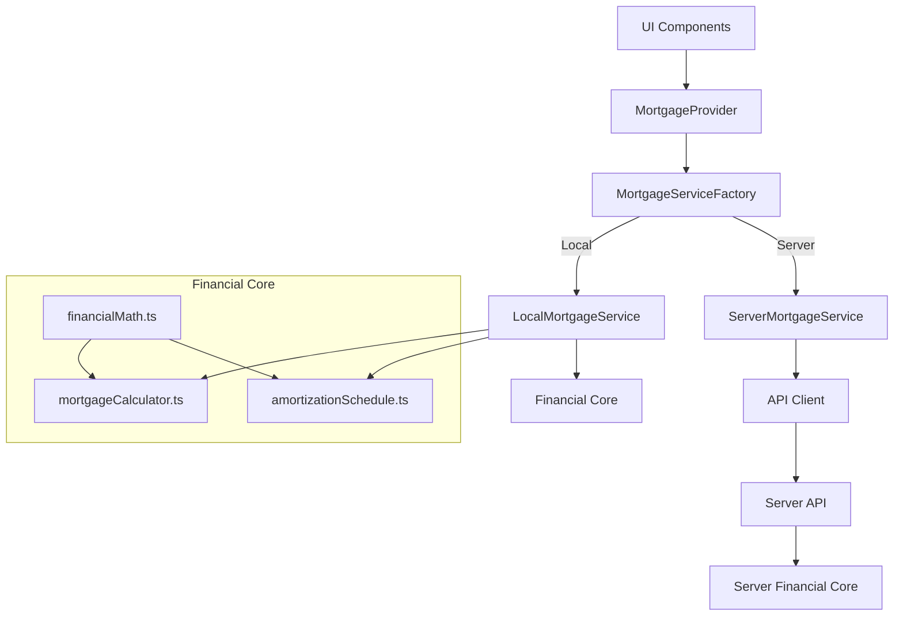

# TASK-21: Application Refactoring and Optimization

## Completed Tasks

### 1. Dead Code Removal
- Removed unused `homeValue` and `downPayment` fields from the `LoanDetailsValues` interface
- Eliminated hardcoded values in `useLoanForm.ts`

### 2. Architecture Improvements
Created a service-oriented architecture following SOLID principles:

- **Service Layer**: Added a dedicated service layer for mortgage calculations
  - `IMortgageService` interface defines the contract for mortgage services
  - `LocalMortgageService` implements calculations in the browser
  - `ServerMortgageService` provides a placeholder for future server implementation
  - `MortgageServiceFactory` creates the appropriate service implementation

- **Configuration System**: Added configuration options in `src/config/mortgage.ts` for easy switching between local and server implementations

- **Dependency Injection**: Updated `MortgageProvider` to use the mortgage service instead of directly calling utility functions

### 3. Preparation for Server-Side Architecture
The new architecture makes it easy to switch between local and server implementations:

- The application can now be configured to use either local or server-based calculations
- The server implementation is ready to be completed when needed
- The interface ensures that both implementations are interchangeable

### 4. Documentation
Added comprehensive documentation:

- `README.md` with project overview, architecture, and future improvements
- `src/services/mortgage/README.md` with detailed documentation for the mortgage service

## Benefits of the Refactoring

1. **Improved Maintainability**: Clear separation of concerns makes the code easier to understand and maintain
2. **Better Scalability**: The application is now ready for both vertical and horizontal scaling
3. **Future-Proof**: Easy to switch to server-side calculations when needed
4. **Cleaner Code**: Removed dead code and improved architecture

## Architecture Diagram

## Recommendations for Further Improvements

1. **Server Implementation**: Complete the `ServerMortgageService` implementation for server-side calculations
2. **Result Caching**: Add caching for calculation results to improve performance
3. **Data Export**: Add functionality to export payment schedules to PDF or Excel
4. **UI/UX Improvement**: Implement a step-by-step wizard instead of a single long form
5. **Scenario Comparison**: Add the ability to compare different mortgage scenarios
